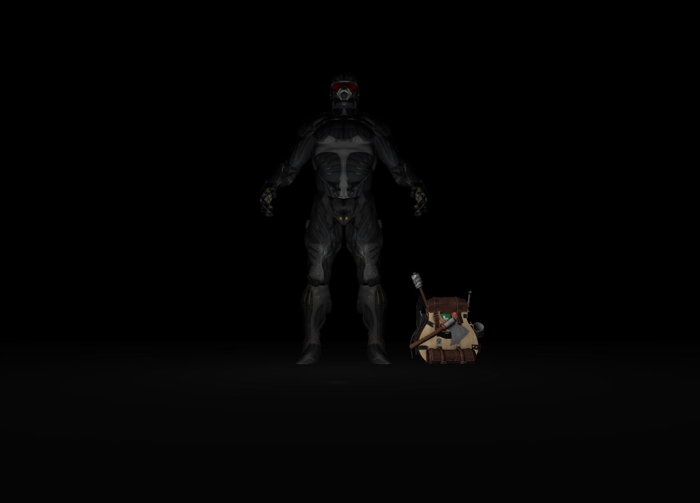

# 🕹️ OpenGL Game Engine (WIP)

This repository contains a small OpenGL-based game engine currently in development. It is inspired by the [LearnOpenGL](https://learnopengl.com/) tutorial series and serves as a modular foundation for real-time rendering and game logic.

## 🚧 Status



## 📦 Features

- Shader management system
- Mesh and model loading via Assimp
- Texture loading with stb_image
- Basic camera and input handling
- Organized rendering loop
- Modular architecture for future expansion

## 🛠️ Dependencies

To build and run the engine, you’ll need to compile and link the following libraries:

| Library   | Purpose                          |
|-----------|----------------------------------|
| **GLFW**  | Window and input management      |
| **GLAD**  | OpenGL function loader           |
| **GLM**   | Math library (vectors, matrices) |
| **Assimp**| Model loading (OBJ, FBX, etc.)   |
| **stb_image** | Texture loading utility     |

## 🧰 Setup (Visual Studio)

1. Clone the repository:
   ```bash
   git clone https://github.com/yourusername/opengl-game-engine.git
  - Compile the required libraries or link prebuilt binaries:

- Place them in an /external folder or configure paths in your project settings.
- In Visual Studio:
- Set C++17 or higher (/std:c++17)
- Add include and lib directories for each dependency
- Link necessary .lib files (e.g., glfw3.lib, assimp.lib)
- Run the project — the entry point is in main.cpp.
