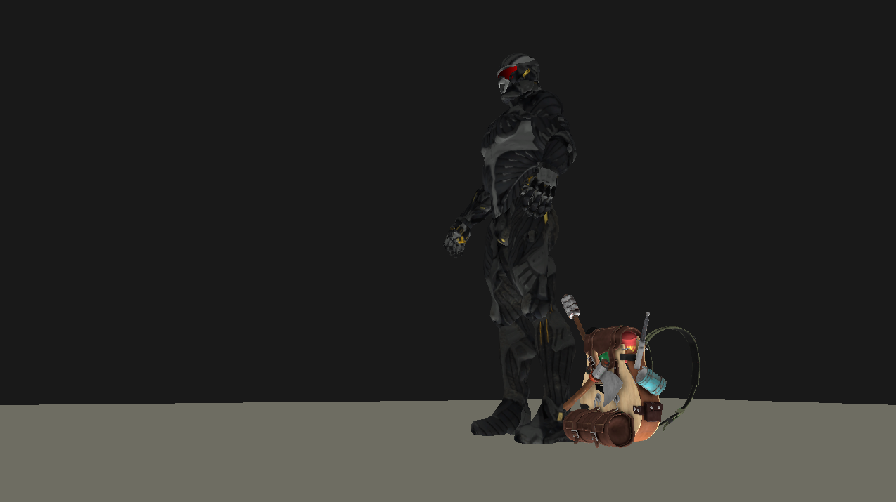

# 🕹️ OpenGL Game Engine

This repository contains a small OpenGL-based game engine currently in development. It is inspired by the [LearnOpenGL](https://learnopengl.com/) tutorial series and serves as a modular foundation for real-time rendering and game logic.

## 🚧 Preview

## 📦 Features

- Shader classes
- Mesh and model loading via Assimp
- Texture loading with stb_image
- Basic camera. Movement in XZ plane with WASD and mouse camer
- Cubemap / Skybox implementation
- Directional Lighting
- Basic Phong Shading & Basic Toon Shading

## 🛠️ Dependencies

To build and run the engine, you’ll need to compile and link the following libraries:

| Library   | Purpose                          |
|-----------|----------------------------------|
| **C-Make** | C-Make                           |
| **GLFW**  | Window and input management      |
| **GLAD**  | OpenGL function loader           |
| **GLM**   | Math library (vectors, matrices) |
| **Assimp**| Model loading (OBJ, FBX, etc.)   |
| **stb_image** | Texture loading utility     |
| **yaml_cpp** | YAML Support |

**Last Updated:** 2026-02-28
**Project:** GL_Engine
