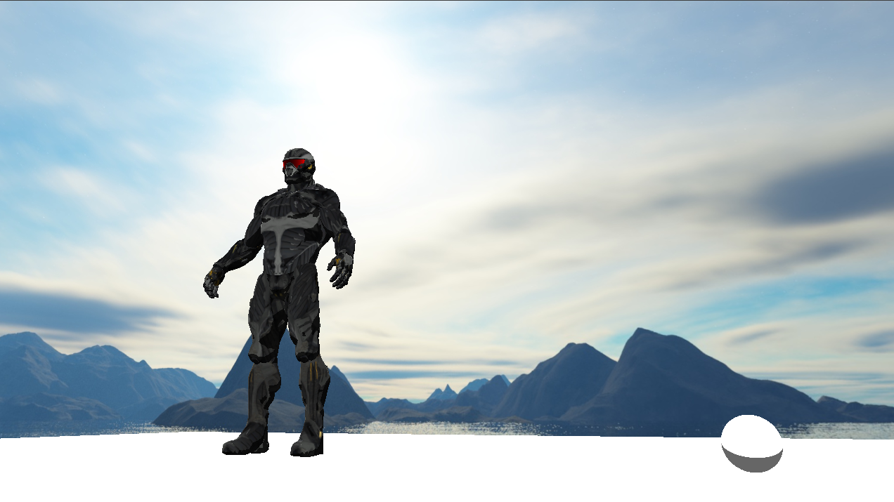

# OpenGL Engine

A small OpenGL-based engine in development, inspired by the [LearnOpenGL](https://learnopengl.com/) tutorial series. Serves as a modular foundation for real-time rendering and game logic.

## Preview




## Features
- CMake build system
- Shader classes
- Mesh and model loading via Assimp
- Texture loading with stb_image
- Basic camera — WASD movement + mouse look
- Cubemap / Skybox
- Directional Lighting
- Phong Shading & Toon Shading
- YAML Scene Definition

## System Requirements
- OpenGL 3.3+ capable GPU and driver
- CMake 3.10+
- C++17 compiler (GCC, Clang, MSVC)

## Dependencies

### Install on Linux (Ubuntu/Debian)
```bash
sudo apt install libglfw3-dev libglm-dev libassimp-dev libyaml-cpp-dev pkg-config
```

### Install on Windows
Use [vcpkg](https://github.com/microsoft/vcpkg):
```bash
vcpkg install glfw3 glm assimp yaml-cpp
```

### Library reference

| Library       | Purpose                           | Source         |
|---------------|-----------------------------------|----------------|
| **CMake**     | Build system                      | system install |
| **GLFW**      | Window and input management       | system install |
| **GLM**       | Math library (vectors, matrices)  | system install |
| **Assimp**    | Model loading (OBJ, FBX, etc.)    | system install |
| **yaml-cpp**  | YAML scene file parsing           | system install |
| **GLAD**      | OpenGL function loader            | bundled in repo |
| **stb_image** | Texture loading utility           | bundled in repo |

## Building

```bash
# Clone the repo
git clone <repo-url>
cd GL_Engine

# Configure
cmake -B build -S .

# Build
cmake --build build

# Run (assets are copied to the build directory automatically)
cd build
./GL_Engine
```

On Windows with vcpkg, pass the toolchain file:
```bash
cmake -B build -S . -DCMAKE_TOOLCHAIN_FILE=<vcpkg-root>/scripts/buildsystems/vcpkg.cmake
cmake --build build
```

**Last Updated:** 2026-06-01
**Project:** GL_Engine
